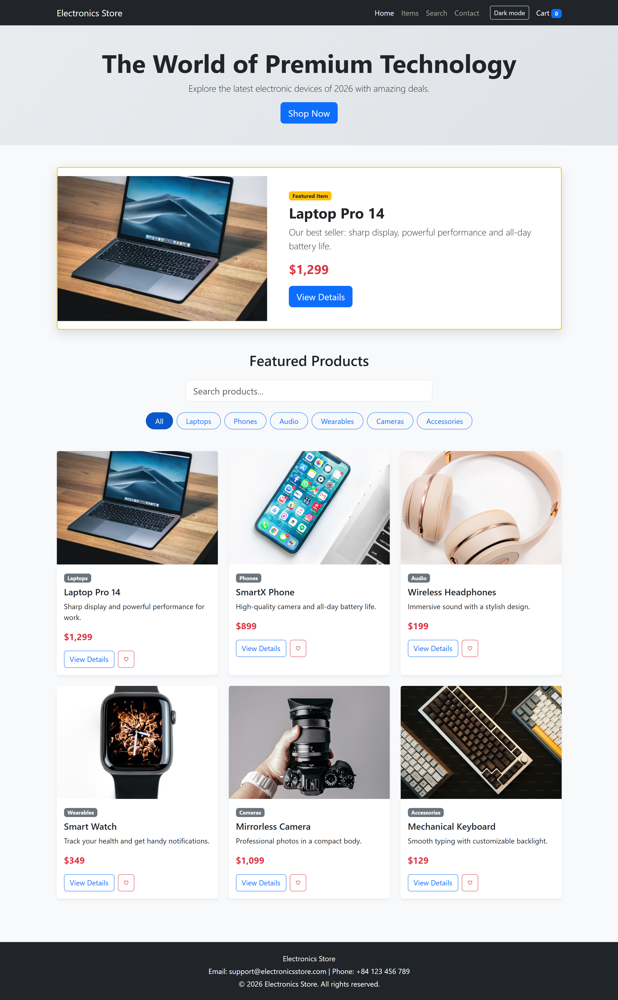
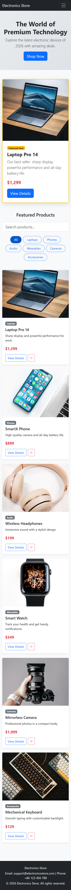

# Electronics Store

A responsive online electronics catalog built with HTML5, CSS3, Bootstrap 5 and vanilla JavaScript. The project focuses on frontend architecture: reusable components, a mobile-first layout and client-side interactivity.

## Features

- Responsive layout for mobile, tablet and desktop (Bootstrap grid, collapsible navbar)
- Reusable header and footer components
- Homepage with hero section, featured item and a 6-product catalog
- Live product search
- Category filter buttons (works together with search)
- Product details page with "Add to Cart" action
- Favorite button and cart counter
- Dark/Light mode, remembered across pages via `localStorage`
- Accessible markup: semantic HTML5, meaningful `alt` text, ARIA labels

All features run in the browser; no backend or database is required.

## Tech stack

HTML5, CSS3, Bootstrap 5.3, JavaScript (ES6), PHP (used only for including shared components)

## Project structure

## Getting started

1. Install [XAMPP](https://www.apachefriends.org/) and start **Apache**.
2. Copy the `electronicsstore` folder into `C:\xampp\htdocs\`.
3. Open `http://localhost/electronicsstore/public/index.php` in your browser.

## Screenshots

## Roadmap

- Connect "View Details" to dynamic data (PHP and MySQL)
- Persistent shopping cart and user accounts

## Author

Ma Tran Minh Quoc